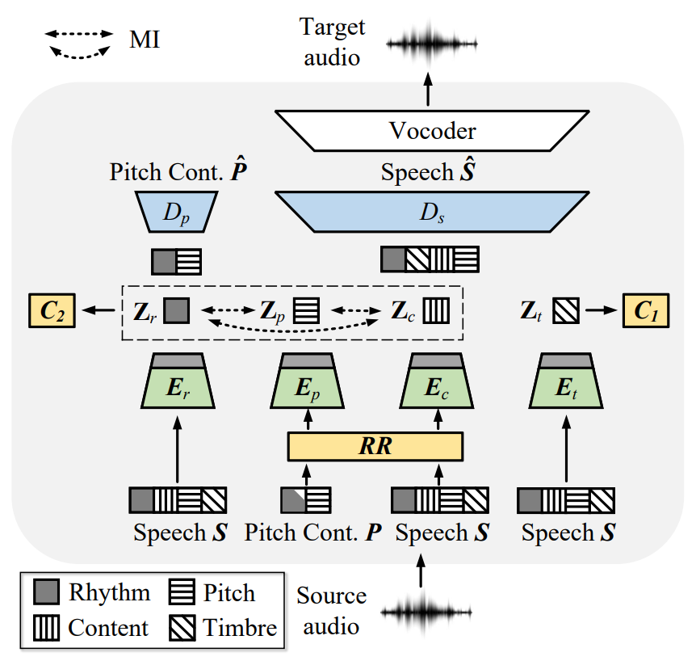

# Speech Representation Disentanglement with Adversarial Mutual Information Learning for One-shot Voice Conversion

### [Paper](https://arxiv.org/abs/2208.08757) | [Demo](https://im1eon.github.io/IS2022-SRDVC/)

<div align=center>

</div>

## 1. Dependencies

Install required python packages:

`pip install -r requirements.txt`

## 2. Quick Start

Download pre-trained model from [here](https://cloud.tsinghua.edu.cn/f/f3f8106a8cda46c5af56/?dl=1) and put it into `My_model/my_demo`.

Download Speechsplit pre-trained model (pitch decoder `640000-P.ckpt` and vocoder `checkpoint_step001000000_ema.pth`) from [here](https://github.com/auspicious3000/SpeechSplit).

Then `cd My_model` and modify paths in `demo.py` to your own paths.

Run `python demo.py` and you will get the converted audio `.wav` in `/my_demo` same like `test_result`.

You else can choose the conditions in `demo.py`.

## 3. Preparation, Training and Inference

Download the VCTK dataset.

Extract spectrogram and f0:`make_spect_f0.py`. 

And modify it to your own path and divide the dataset, run `data_split.py`.

Generate training metadata: `make_metadata.py`.

Run the training scripts: `main.py`.

Generate testing metadata: `make_test_metadata.py`.

Run the inference scripts: `inference.py`

## 4. Evaluation

You may refer to the following: `WER.py`, `mcd.py`, `f0_pcc.py`, `draw_f0_distributions.py`, `draw_speaker_embedding.py`

## 5. Acknowledgement and References

 This work is supported by National Natural Science Foundation of China (NSFC)
(62076144), National Social Science Foundation of China
(NSSF) (13&ZD189) and Shenzhen Key Laboratory of
next generation interactive media innovative technology
(ZDSYS20210623092001004).

Our work mainly inspired by:

(1) [SpeechSplit](https://github.com/auspicious3000/SpeechSplit#readme):

> K. Qian, Y. Zhang, S. Chang, M. Hasegawa-Johnson, and D. Cox, “Unsupervised speech decomposition via triple information bottleneck,” in International Conference on Machine Learning. PMLR, 2020, pp. 7836–7846.


(2) [VQMIVC](https://github.com/Wendison/VQMIVC):


> D. Wang, L. Deng, Y. T. Yeung, X. Chen, X. Liu, and H. Meng, “VQMIVC: Vector Quantization and Mutual Information-Based Unsupervised Speech Representation Disentanglement for One-Shot Voice Conversion,” in Interspeech, 2021, pp. 1344–1348.


(3) ClsVC:

> H. Tang, X. Zhang, J. Wang, N. Cheng, and J. Xiao, “Clsvc: Learning speech representations with two different classification tasks.” Openreview, 2021, https://openreview.net/forum?id=xp2D-1PtLc5.


[comment]: <> (  pages={846--850},)

[comment]: <> (  doi={10.21437/Interspeech.2021-1990})

## 6. Citation

If you find our work useful in your research, please consider citing:

```
@inproceedings{yang2022speech,
  author={SiCheng Yang and Methawee Tantrawenith and Haolin Zhuang and Zhiyong Wu and Aolan Sun and Jianzong Wang and ning cheng and Huaizhen Tang and Xintao Zhao and Jie Wang and Helen Meng},
  title={{Speech Representation Disentanglement with Adversarial Mutual Information Learning for One-shot Voice Conversion}},
  year=2022,
  booktitle={Proc. Interspeech 2022},
}
```

Some results can be found [here](https://blog.csdn.net/qq_41897800/article/details/122616675).
Please feel free to contact us ([yangsc21@mails.tsinghua.edu.cn](yangsc21@mails.tsinghua.edu.cn)) with any question or concerns.


